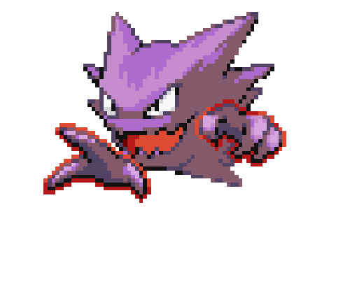

  <h1>👩‍💻 Emily Rharysa</h1>
  

     
## 🚀 About Me
*`Building real skills through real projects.`*

- 🎓 Technology student
- 💻 Web Developer focused on responsive interfaces
- 🧠 Studying Data Structures & Computer Architecture
- 📈 Constantly improving logic and software fundamentals
- 🤝 Open for freelance and junior opportunities`

## ⚙️ Technologies

### 🎨 Front-End

---

### 💻 Programming Languages

---

### 🗄️ Database

---

### 🌐 CMS & Design

---

### 🛠 Tools

## 🚀 Currently Learning

## 🔥 Want To Learn

## 📊 GitHub Stats

  
  

## 🎯 Current Focus

- Strengthening programming fundamentals
- Preparing for modern front-end frameworks
- Building consistent and scalable projects

## 🤝 Open For
- Freelance projects
- Junior developer opportunities
- Collaborative learning projects
